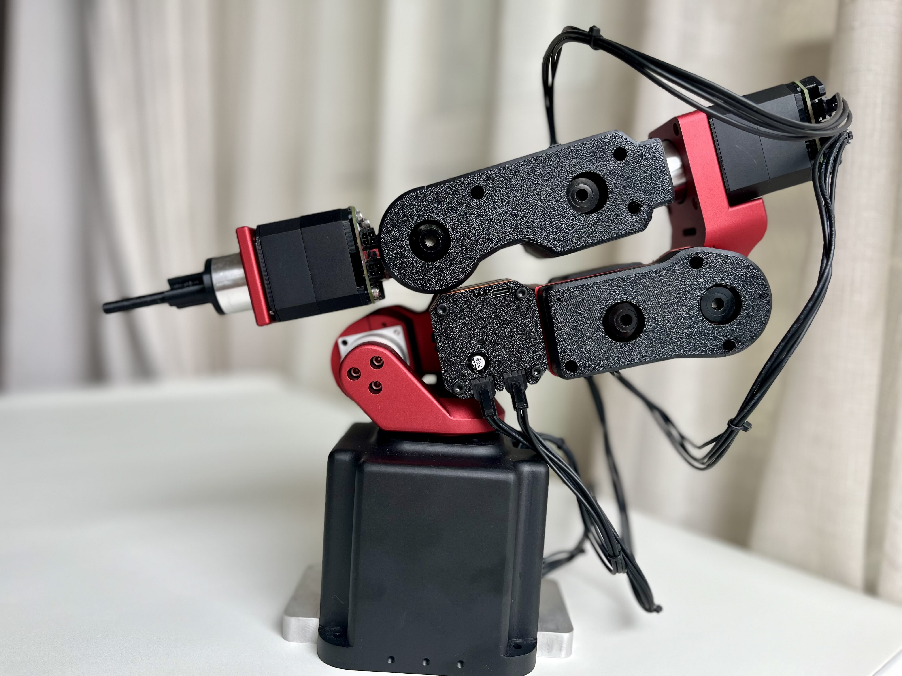
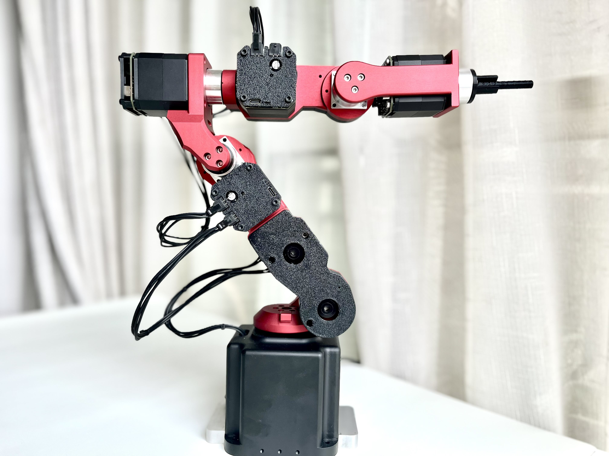
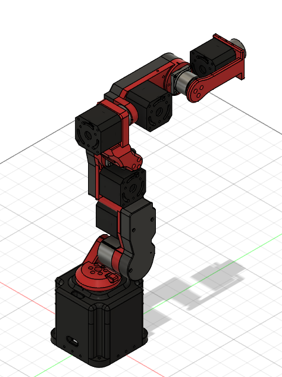
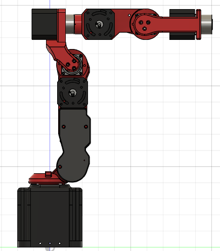
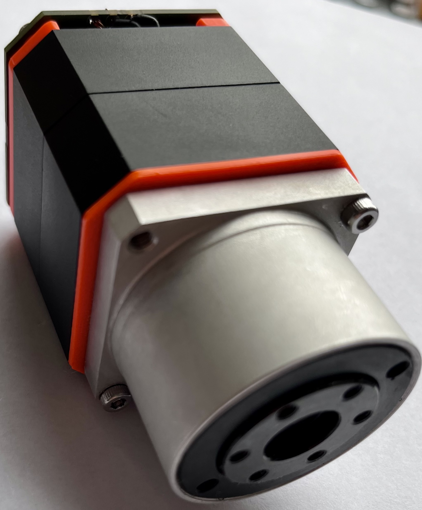
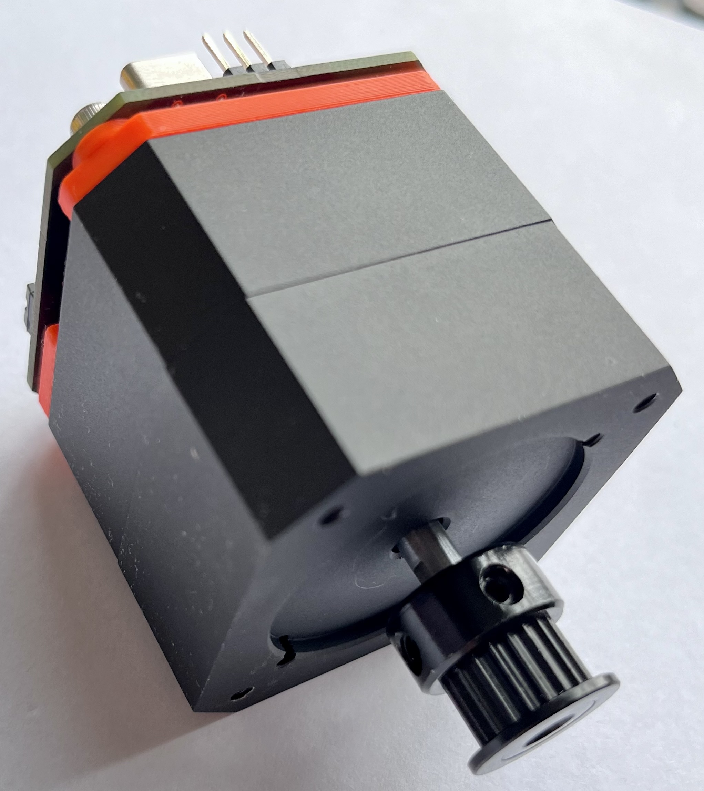
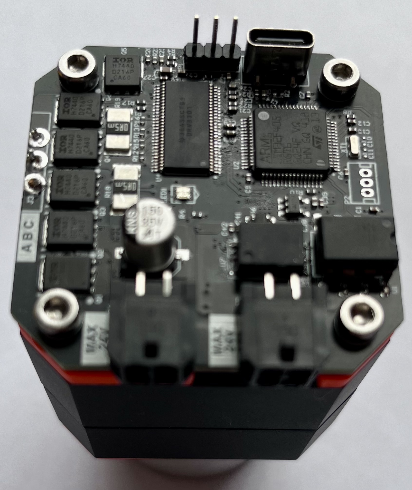

# Dummy2
Fully BLDC actuator designed version.
- Opensource/hardware designed
- 0.01mm to 0.05mm repeat move accuracy
- up to 1KG payload
- redesigned construction, 30% cost cut off
- supports ROS2, MATLAB by directly
- Ethernet to CAN bus controller
- support kinematics dynamics algorithm
- Fast, flexible, precise, and smooth movement

[demo video](https://www.bilibili.com/video/BV1RxxCeNEB7/?vd_source=07b586148810bad00b3ab53a6553d1f6 "demo video")

# Dummy2 3d model reference

# Dummy2 actuator pics

### Dummy2 is under GPLv3 Licence
