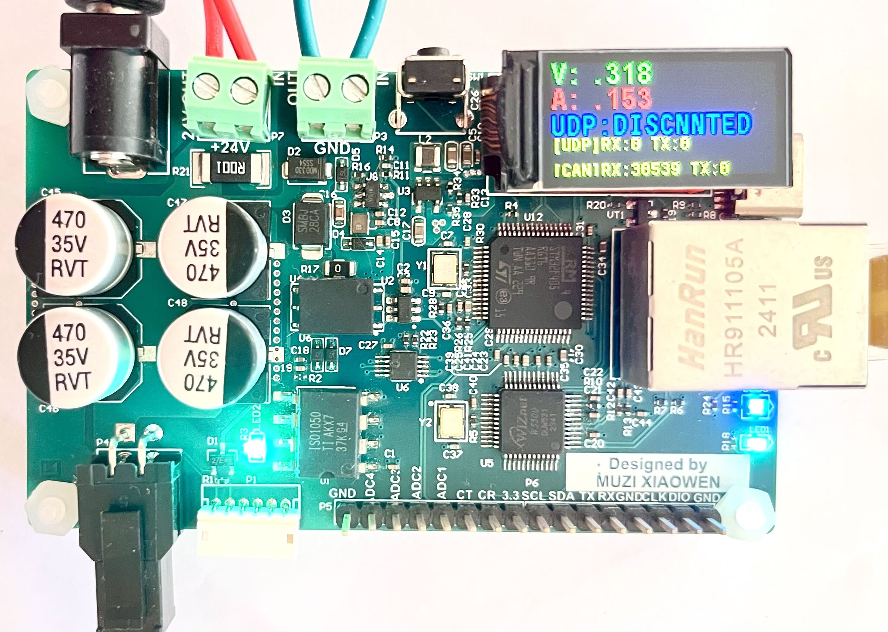

# ETH2CAN dummy2 controller

Dummy2 ethernet to can bus, opensource designed, supports: 
- ROS2, MATLAB
- host computer's algorithm talks to the motor driver board throw CAN bus directly, easily verify your algorithm, high performance
- FIFO buffer added to make sure no commands are lost
- hardware ethernet MAC chip
- real-time position, velocity, current, and voltage monitoring
- up to 2KHZ commands send/receive (response) period
- IPS TFT 0.96’ display shows current, voltage, Ethernet states, and CAN bus states in real-time

