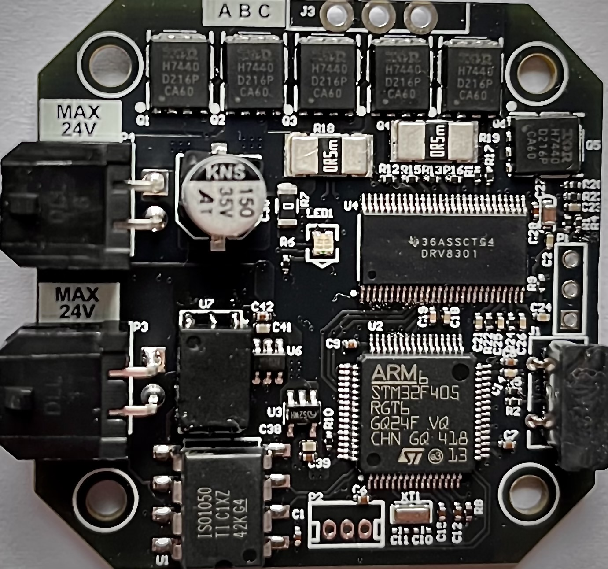
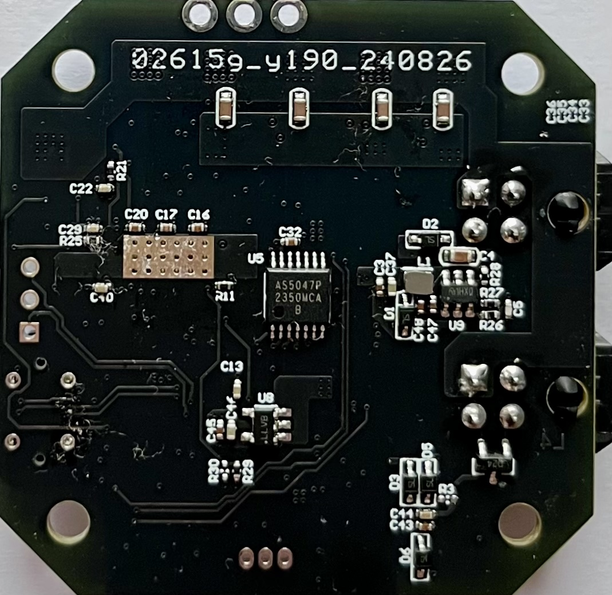
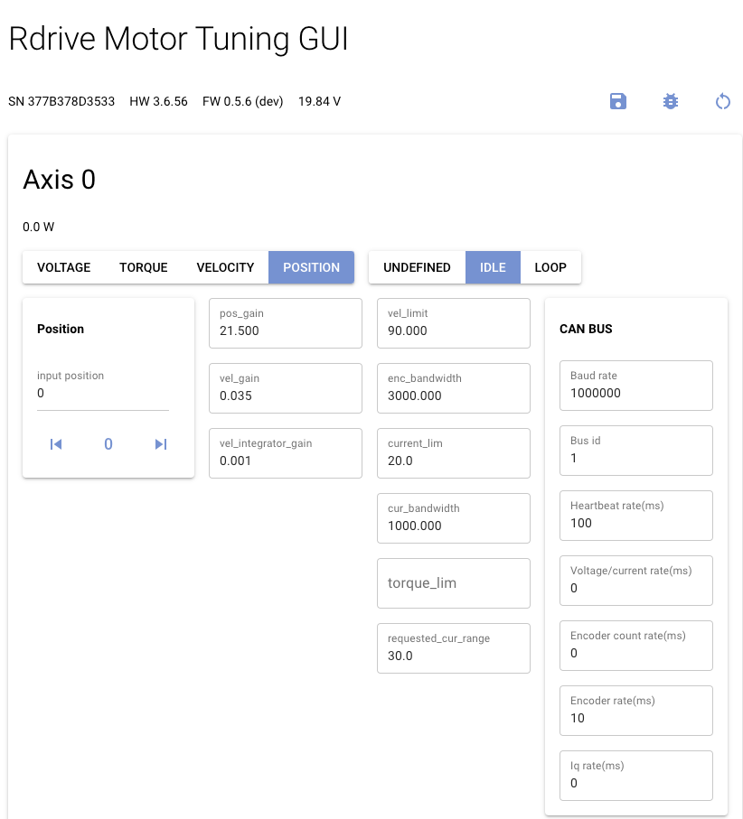
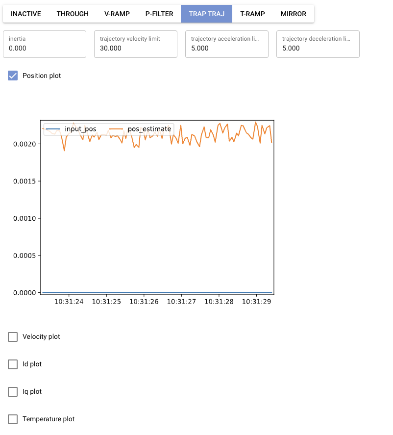

# Rdrive

Opensource designed BLDC actuator, which includes a driver board, aluminum enclosure and GUI of configuration, it also supports:
- isolated CAN bus up to 1M bps
- up to 20A current, current loopback mode
- Precision control - Torque, Velocity, Position & Trajectory control
- AS5047 encoder

## #  **Rdrive board**

## Rdrive GUI

